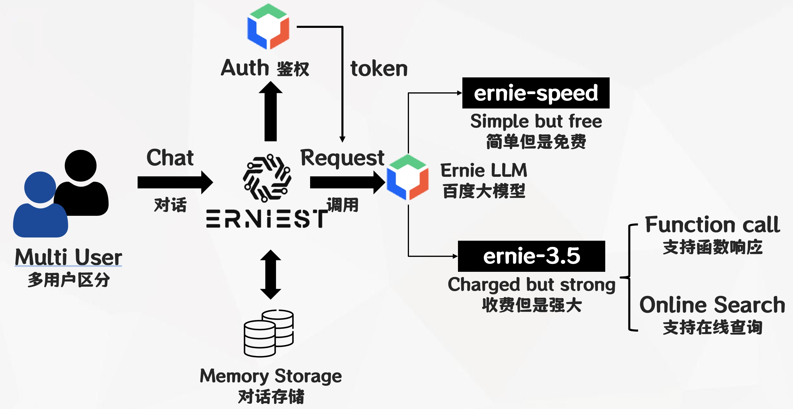
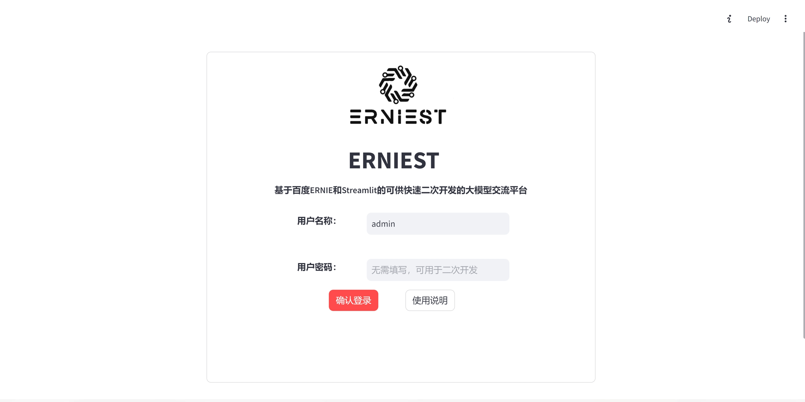
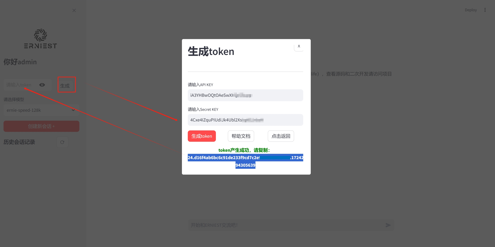
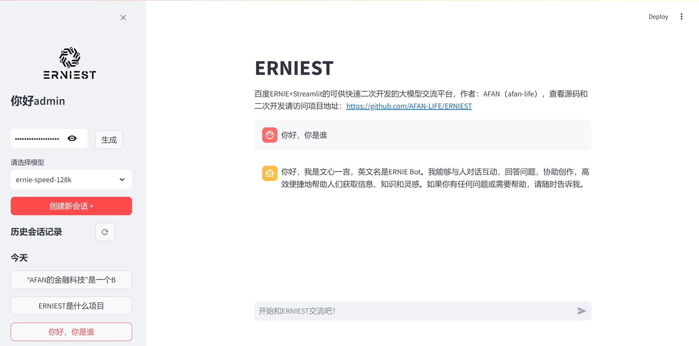
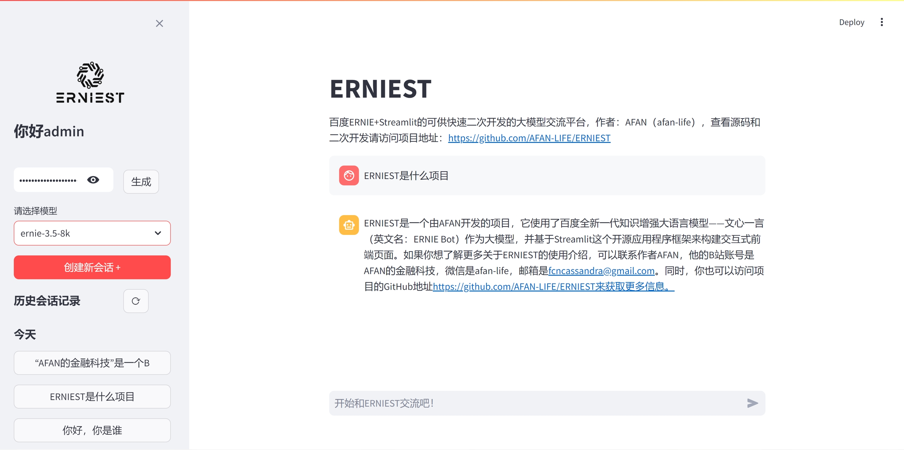
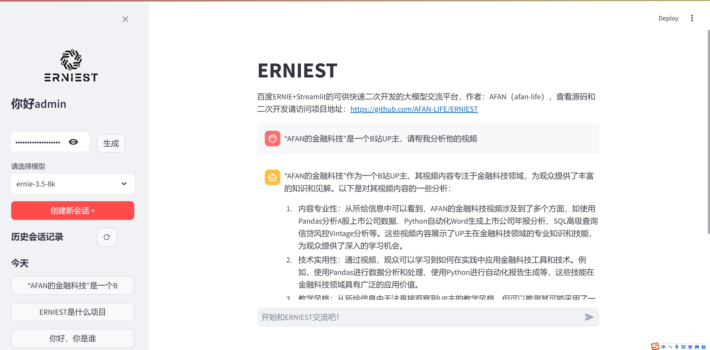

# ERNIEST

基于百度ERNIE和Streamlit的可供快速二次开发的大模型交流平台  
A large model communication platform based on Baidu ERNIE and Streamlit for rapid secondary development

在线体验：https://erniest.streamlit.app/  
Online experience：https://erniest.streamlit.app/ 

**作者：AFAN（微信：afan-life，邮箱：fcncassandra@gmail.com）**  
**Author: AFAN (WeChat: afan-life, Email: fcncassandra@gmail.com)**

## 功能设计 Functional Design

本项目目前包含如下功能：
This project currently includes the following features:
  
- 1 用户登录，支持根据不同用户名登录显示不同的历史对话记录，可供二次开发增加更多鉴权方式  
- 1 User login, supporting different historical conversation records based on different usernames, allowing for further development to add more authentication methods
- 2 百度千帆大模型接入，内置免费token，支持在界面中进行百度千帆大模型的token获取，以及模型版本切换  
- 2 Integration with Baidu Qianfan large model, with built-in free tokens, supporting token acquisition and model version switching in the interface.
- 3 对话存储，使用sqlite存储会话的主题（前15个字符）以及主题对应下的所有对话记录，支持用户新建主题  
- 3 Conversation storage, using SQLite to store conversation themes (first 15 characters) and all conversation records under the theme, supporting user-created themes
- 4 函数响应，基于大模型的function call功能，可以定制函数和描述json，在对话内容涉及到时触发函数  
- 4 Function call, based on the function call feature of the large model, allowing customization of functions and description JSONs, triggered when relevant conversation content is detected

以下是所有功能的交互流程：  
Below is the interaction flow of all features:  


## 界面说明 Interface Description

登录界面。用户默认可以不输入密码直接登录使用，使用不同用户名登录后将显示不同的历史对话记录  
Login Interface. Users can log in and use the platform without entering a password by default. Logging in with different usernames will display different historical conversation records.



对话界面。对话过程中需要使用大模型的token权限，目前本平台内置了作者的免费token，用户可以基于此免费使用ernie-speed的模型进行对话，但是该模型不支持函数响应和在线查询。  
Conversation Interface. During conversations, the large model's token permissions are required. The platform currently includes the author's free token, allowing users to use the ernie-speed model for conversations, but this model does not support function call and online searches.

用户可以选择ernie-3.5模型，它将支持函数响应和在线查询，但是需要用户自己生成token，需要在百度智能云平台注册付费后，将APP Key和Secret Key输入后获取，详细获取方式参考：https://cloud.baidu.com/article/1089328  
Users can choose the ernie-3.5 model, which supports function call and online searches. However, users need to generate their own tokens by registering and paying on Baidu Smart Cloud, entering the APP Key and Secret Key to obtain the token. Detailed instructions can be found at: https://cloud.baidu.com/article/1089328



简单对话界面，用户可以直接使用ernie-speed的模型进行对话，内置token权限支持该会话。  
Simple Conversation Interface. Users can directly use the ernie-speed model for conversations, with built-in token permissions supporting the conversation.



函数响应，平台内置了一个项目描述的函数样例，当谈话触及到该项目时，函数会触发并将返回结果再次输入到大模型进行润色后输出。  
Function Call. The platform includes a sample function for project description. When the conversation touches on this project, the function is triggered, and the result is re-entered into the large model for polishing and output.



在线查询，ernie-3.5版本支持大模型在线查询公开网站的信息，比如这是一个查询项目作者在B站账号的使用样例  
Online Search. The ernie-3.5 version supports online search of public websites' information by the large model. For example, this is a sample query about the project author's Bilibili account.



## 项目使用 Project Usage

本工程推荐使用`Python=3.9`，并建议另外新建conda环境，防止版本交叉污染：  
This project recommends using Python=3.9, and it is suggested to create a new conda environment to prevent version conflicts:

```
conda create -n erniest python=3.9
```

Python的核心包版本：  
Core Python package versions:

```
streamlit                    1.35.0
streamlit-modal              0.1.2
qianfan                      0.4.2
```

可以一步安装：  
Install all dependencies with one command:

```
pip install -r requirements.txt
```

如果需要安装向量数据库faiss，可以执行
```
conda install faiss-cpu==1.8.0 -c pytorch
```

在erniest的conda环境下执行：  
Run the following command in the erniest conda environment:

```
streamlit run main.py
```

## 代码模块 Code Modules

本项目的主要文件结构对应的代码模块关系如下：  
The main file structure of this project and the corresponding code modules are as follows:

- asset 存储项目的静态资源 Stores the project's static resources
- database 进行项目数据库的初始化建表，以及数据库的链接 Initializes and creates tables for the project's database, and handles database connections
- function 进行大模型的函数响应代码和函数描述编写 Contains code and function descriptions for large model function responses
- llm 百度千帆大模型接入模块，并将function模块加以注册 Baidu Qianfan large model integration module, registering the function module
- service 系统业务功能模块，包含如对话记录的数据库查询和存储 System business function module, including database queries and storage of conversation records
- view 系统的视图模块 System view module
  - login.py 用户登录，会调取auth.py进行鉴权 User login, calls auth.py for authentication
  - sidebar.py 登录后的左侧会话历史会话主题列表，包括token输入获取、模型版本切换 Sidebar showing historical conversation themes after login, including token input and retrieval, model version switching
  - chat.py 登录后的对话界面 Conversation interface after login
  - tool.py 其他工具函数，如图片展示 Other utility functions, such as image display
- auth.py 鉴权代码模块，默认不输入密码直接通过 Authentication code module, default is to pass without password
- config.py 系统配置模块，包含数据库、默认token和streamlit展示相关的配置 System configuration module, including database, default token, and Streamlit display related configurations
- gpt.db 启动database模块后产生的sqlite数据库文件 SQLite database file generated after starting the database module
- log.py 日志模块 Log module
- main.py 主模块，启动入口 Main module, entry point

## 深入学习 Further Learning

扫码加入知识星球：AFAN的金融科技，收看关于ERNIEST项目的源码教学：    
Scan the code to join the Knowledge Planet: AFAN's Fintech, for source code teaching of the ERNIEST project:  


微信联系AFAN，加入金融科技学习社群（微信：afan-life）：  
Contact AFAN on WeChat to join the Fintech learning community (WeChat: afan-life):


## 更新记录 Update Log

- 2024/07/25：首次上传ERNIEST V1.0 First upload of ERNIEST V1.0