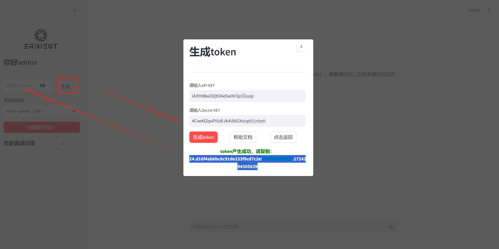
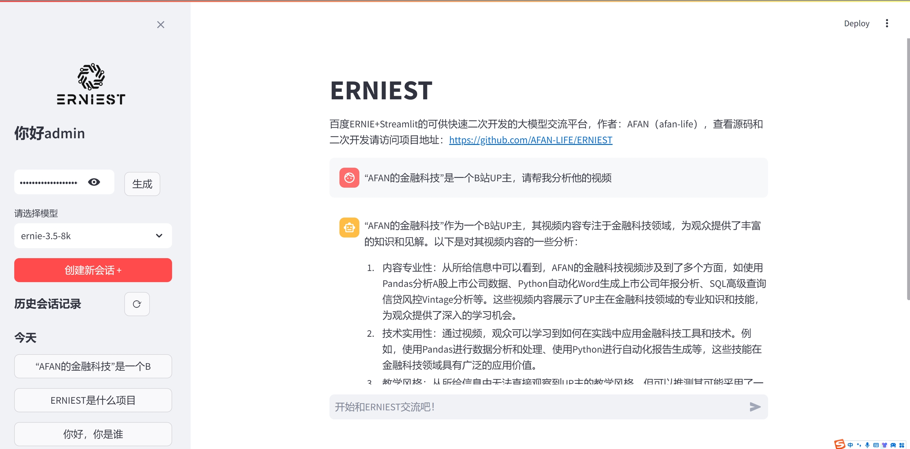

# ERNIEST
**其他语言版本: [English](README.md), [中文](README_zh.md).**

基于百度ERNIE和Streamlit的可供快速二次开发的大模型交流平台  

**作者：AFAN（微信：afan-life，邮箱：fcncassandra@gmail.com）**  
在线体验：https://erniest.streamlit.app/  


## 功能设计

本项目目前包含如下功能：

- 1 用户登录，支持根据不同用户名登录显示不同的历史对话记录，可供二次开发增加更多鉴权方式  
- 2 百度千帆大模型接入，内置免费token，支持在界面中进行百度千帆大模型的token获取，以及模型版本切换  
- 3 对话存储，使用sqlite存储会话的主题（前15个字符）以及主题对应下的所有对话记录，支持用户新建主题  
- 4 函数响应，基于大模型的function call功能，可以定制函数和描述json，在对话内容涉及到时触发函数  

以下是所有功能的交互流程：  


## 界面说明 Interface Description

登录界面。用户默认可以不输入密码直接登录使用，使用不同用户名登录后将显示不同的历史对话记录  


对话界面。对话过程中需要使用大模型的token权限，目前本平台内置了作者的免费token，用户可以基于此免费使用ernie-speed的模型进行对话，但是该模型不支持函数响应和在线查询。  

用户可以选择ernie-3.5模型，它将支持函数响应和在线查询，但是需要用户自己生成token，需要在百度智能云平台注册付费后，将APP Key和Secret Key输入后获取，详细获取方式参考：https://cloud.baidu.com/article/1089328  



简单对话界面，用户可以直接使用ernie-speed的模型进行对话，内置token权限支持该会话。  


函数响应，平台内置了一个项目描述的函数样例，当谈话触及到该项目时，函数会触发并将返回结果再次输入到大模型进行润色后输出。  


在线查询，ernie-3.5版本支持大模型在线查询公开网站的信息，比如这是一个查询项目作者在B站账号的使用样例  



## 项目使用 Project Usage

本工程推荐使用`Python=3.9`，并建议另外新建conda环境，防止版本交叉污染：  

```
conda create -n erniest python=3.9
```

Python的核心包版本：  

```
streamlit                    1.35.0
streamlit-modal              0.1.2
qianfan                      0.4.2
```

可以一步安装：  

```
pip install -r requirements.txt
```

在erniest的conda环境下执行：  

```
streamlit run main.py
```

## 代码模块 Code Modules

本项目的主要文件结构对应的代码模块关系如下：  

- asset 存储项目的静态资源 
- database 进行项目数据库的初始化建表，以及数据库的链接
- function 进行大模型的函数响应代码和函数描述编写
- llm 百度千帆大模型接入模块，并将function模块加以注册
- service 系统业务功能模块，包含如对话记录的数据库查询和存储
- view 系统的视图模块
  - login.py 用户登录，会调取auth.py进行鉴权 User login,
  - sidebar.py 登录后的左侧会话历史会话主题列表，包括token输入获取、模型版本切换 
  - chat.py 登录后的对话界面 
  - tool.py 其他工具函数，如图片展示
- auth.py 鉴权代码模块，默认不输入密码直接通过
- config.py 系统配置模块，包含数据库、默认token和streamlit展示相关的配置 related configurations
- gpt.db 启动database模块后产生的sqlite数据库文件
- log.py 日志模块
- main.py 主模块，启动入口 

## 深入学习 Further Learning

扫码加入知识星球：AFAN的金融科技，收看关于ERNIEST项目的源码教学：    


微信联系AFAN，加入金融科技学习社群（微信：afan-life）：  


## 更新记录 Update Log

- 2024/07/25：首次上传ERNIEST V1.0 First upload of ERNIEST V1.0